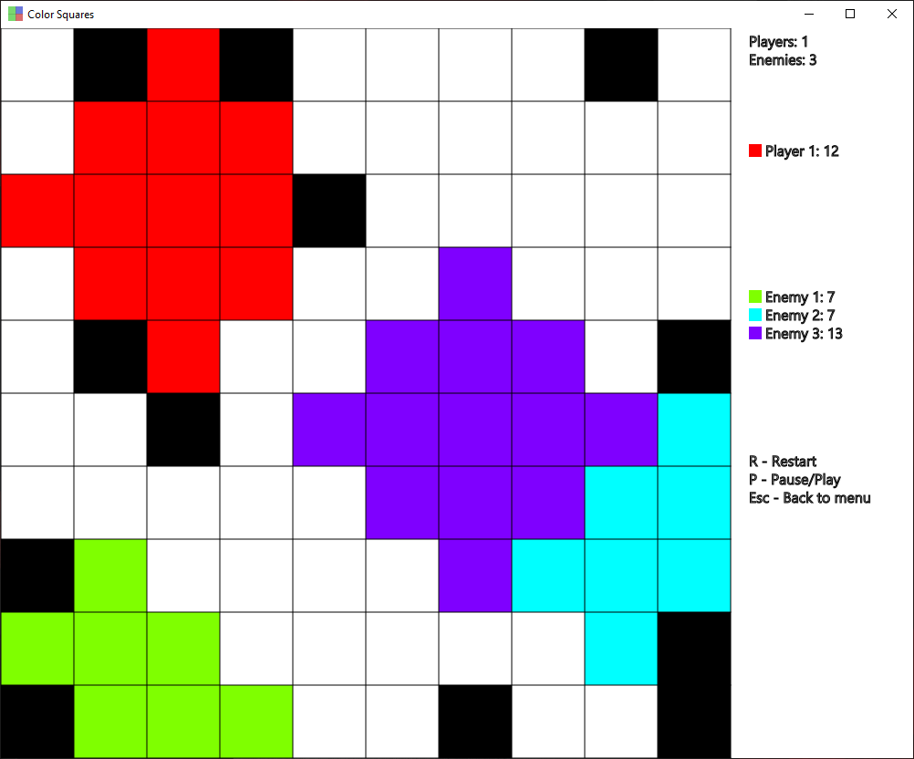

# Color Squares

Color Squares is a game where you need to take as much space as possible or in other words more than your opponents. You place your color starting point on map and it will expand and occupy empty spaces. Before starting the game you can modify map size, number of: players, enemies and obstacles.

It is written with the use of Java 14, Gradle 6.5 and JavaFX 11.0.2.



## Running the app

To run app just execute:
```bash
gradlew run
```

If you want to generate jar file run command:
```bash
gradlew jar
```
Generated jar file will be in `build\libs`. You can simply start app by clicking on it or by running command:
```bash
java -jar "Color Squares-1.0.jar"
```